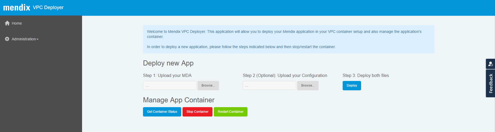

## 1 Introduction
This solution offers a frictionless deployment of Mendix apps on Microsoft Azure for Virtual Private Cloud users (denoted as VPC users hereafter).

It consist of a topology, declared as an ARM template, which arranges all the necessary Azure resources in order to deploy a Mendix app. The installation provides the following:

- Externalized data tier using the Azure DB and Blob Store services
- Docker containers to deploy the app
- New VPC Deployer to manage your installation


## <a name="Prerequisites"></a>2 Prerequisites

### 2.1 Microsoft Azure Account
You will need a Microsoft account to have access to the [Azure Portal](https://portal.azure.com).


### 2.2 Mendix Application MDA
The Mendix Deployment Package (MDA file) of your application to be deployed.

### 2.3 Mendix Application configuration file
This step is only required if your application using [Constants](https://docs.mendix.com/refguide6/Constants)


## 3 Installation steps

### 3.1 Select template


In the [Azure Marketplace](https://azure.microsoft.com/en-us/marketplace/), you can choose the template more suitable to your needs. Currently, we offer the following:

- Mendix Pro Edition - 50 users
- Mendix Pro Edition - 100 users
- Mendix Pro Edition - 250 users
- Mendix Pro Edition - BYOL

### 3.2 Start template


As indicated above, you select the template and click the button 'Create' in order to create a new installation in you Azure account.

> Depending on Azure region of your choice, the creation may take several minutes.

### 3.3 VPC Portal


Once the installation is completed, you should be able to inspect the resources created as you can see in the picture above.

The public IP resource is the endpoint you will use to access your VPC Deployer instance and your app once is deployed.


- Mendix App: ``` DNS_NAME/ ```
- VPC Deployer: ``` DNS_NAME/vpcdeployer ```


### 3.4 Upload MDA and Config file
You have to follow the steps defined in the VPC Deployer




## 4. Deploying your Mendix Application

To deploy the new app, VPC Deployer will shutdown any application container running at that moment, with your confirmation, before to spin up a new one with the new application files.

## 5. Related Content

- [Microsoft Azure Documentation](https://docs.microsoft.com/en-us/azure/)
